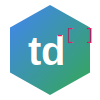

# 📅 td (To-Do ToDay)



To-Do ToDay is a simple, efficient Text User Interface (TUI) app for tracking tasks with a focus on daily workflow. Seamlessly add and check off tasks while the backend stores your progress in easy-to-read markdown files.

## 🌟 Features

- 📝 Quick task addition and management
- ✅ Simple checkbox-style task completion
- 📁 Markdown file storage for easy version control and portability
- 📆 Daily, weekly, and monthly view options
- 🖥️ Clean and intuitive TUI for distraction-free productivity

## 🚀 Getting Started

### Prerequisites

- Go 1.16 or higher

### Installation

1. Clone the repository:
   ```bash
   git clone https://github.com/yourusername/td.git
   cd td
   ```

2. Build the application:
   ```bash
   go build -o td main.go
   ```

3. (Optional) Move the binary to a location in your PATH for easy access:
   ```bash
   sudo mv td /usr/local/bin/
   ```

## 🎯 Usage

To see all available commands:
```bash
td --help
```

### Common Commands

- Add a task:
  ```bash
  td add "Complete project proposal"
  ```

- List tasks:
  ```bash
  td list
  ```

- Start a Pomodoro session:
  ```bash
  td pomo
  ```

## 🛠️ Development

### Run Locally

To run the application without building:

```bash
go run main.go
```

### Testing

Run the test suite:

```bash
go test -v ./...
```

## 📄 License

This project is licensed under the MIT License - see the [LICENSE](LICENSE) file for details.

## 🙏 Acknowledgements

- [Cobra](https://github.com/spf13/cobra) for CLI interface
- [Bubble Tea](https://github.com/charmbracelet/bubbletea) for terminal UI framework

---

Happy task managing with td! 🎉